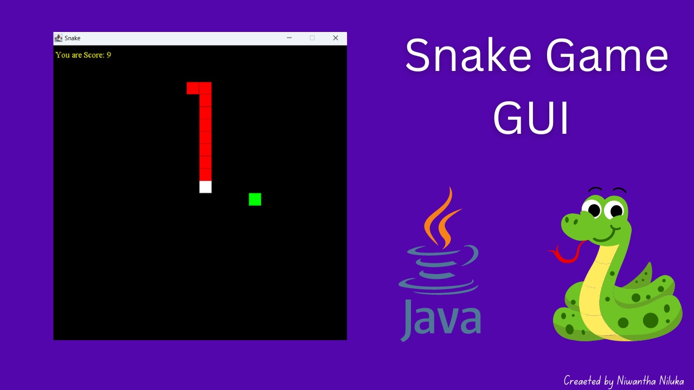

# JavaSnakeGame
Welcome to the Snake Game implemented using Java Swing! This classic arcade game is developed to demonstrate GUI development and basic game mechanics using Java.

## Features

- Classic snake gameplay
- Simple and intuitive controls
- Score tracking
- Game over detection

## Screenshots



## Getting Started

### Prerequisites

- Java Development Kit (JDK) 8 or higher

### Installation

1. Clone the repository:
    ```sh
    git clone https://github.com/yourusername/yourrepository.git
    ```
2. Navigate to the project directory:
    ```sh
    cd yourrepository
    ```
3. Compile the project:
    ```sh
    javac src/*.java
    ```
4. Run the game:
    ```sh
    java src.Main
    ```

## Controls

- Use the arrow keys to move the snake:
  - Up: ↑
  - Down: ↓
  - Left: ←
  - Right: →

## Contributing

Contributions are welcome! Please fork this repository and submit a pull request with your changes.

## License

This project is licensed under the MIT License - see the [LICENSE](LICENSE) file for details.

## Contact

If you have any questions or suggestions, feel free to reach out!

---

🎮 Developed by [Your Name](https://www.linkedin.com/in/yourprofile)

